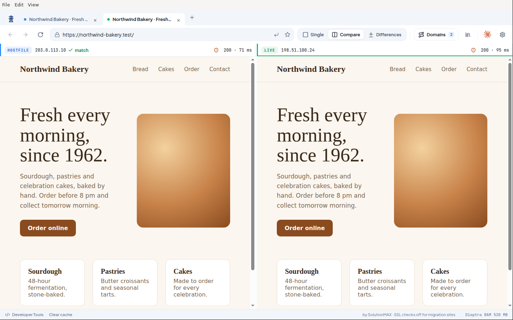
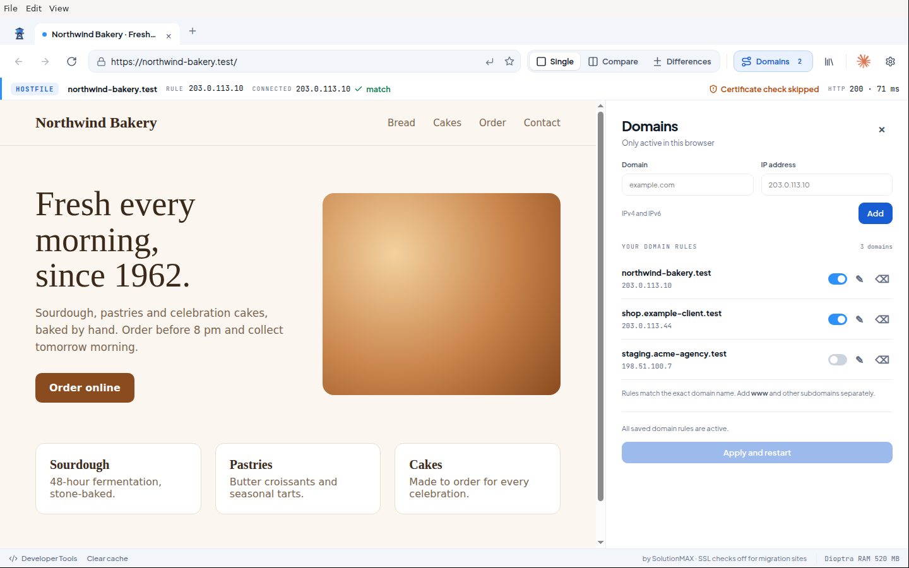
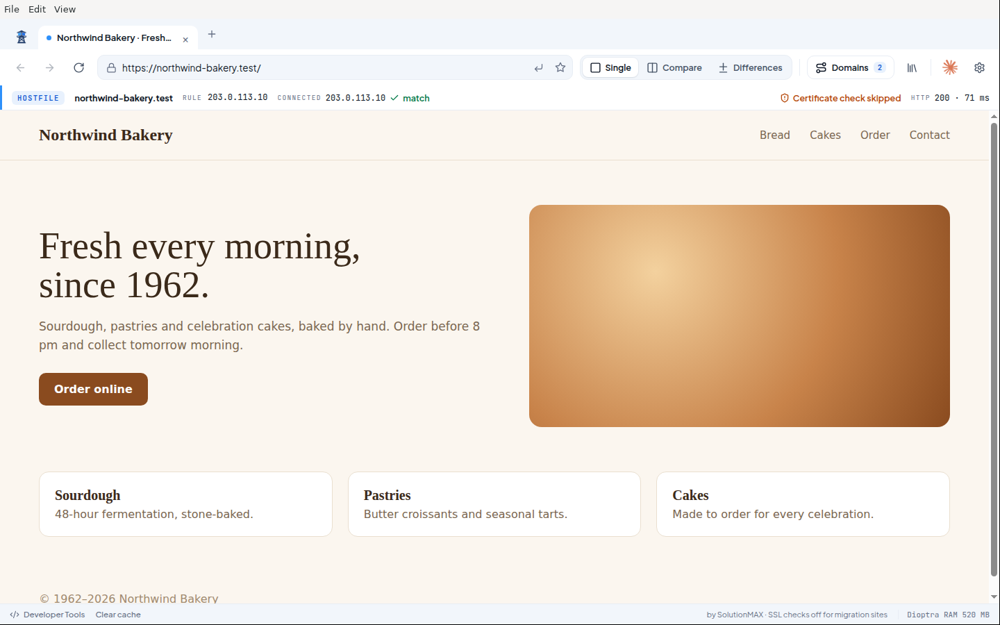
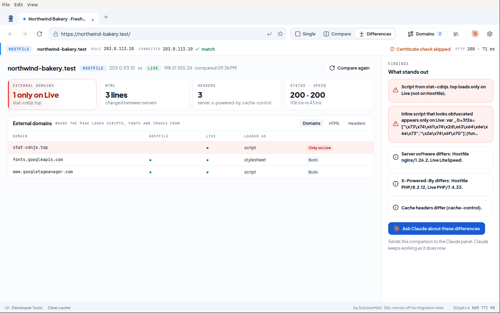
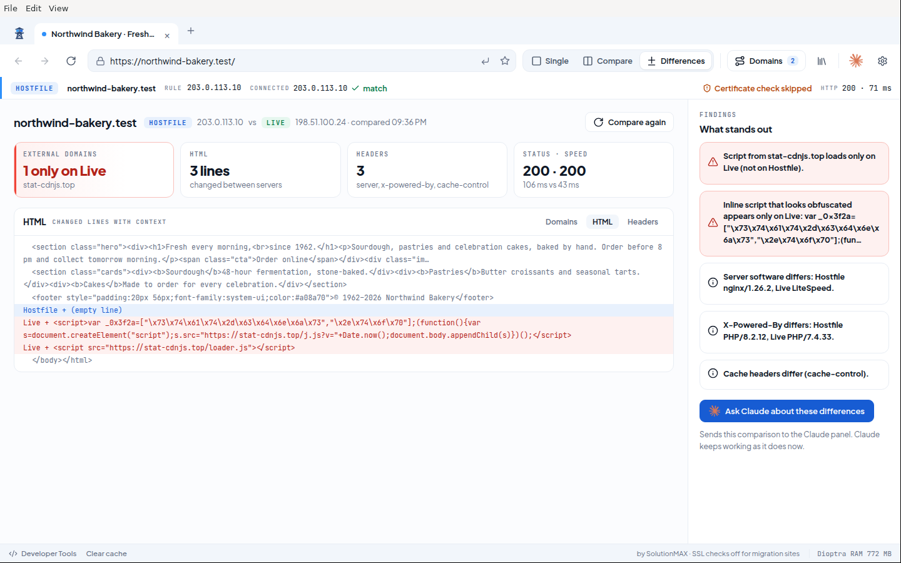
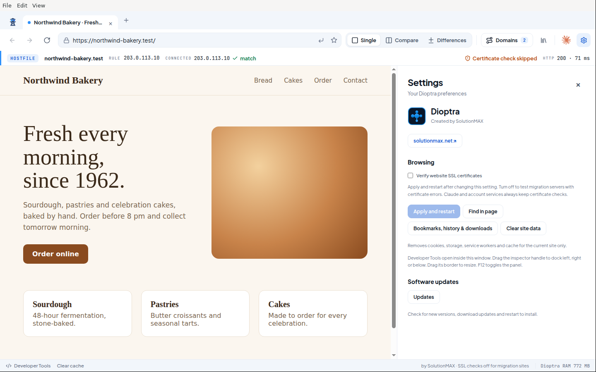

<p align="center">
  <picture>
    <source media="(prefers-color-scheme: dark)" srcset="docs/screenshots/logo-dark.png">
    
  </picture>
</p>

<h1 align="center">Dioptra</h1>

<p align="center"><b>Same domain. Different server.</b><br>
A browser for website migrations: open any site on its new server before DNS changes, compare it with the live site, and spot what is different.</p>

<p align="center">
  <a href="../../releases/latest"><b>Download</b></a> ·
  <a href="#how-it-works">How it works</a> ·
  <a href="#install">Install</a> ·
  <a href="docs/technical-notes.md">Technical notes</a>
</p>



## Why Dioptra

Moving a website to a new server usually means editing `/etc/hosts`, flushing DNS, and guessing which server you are actually looking at. Dioptra does this inside one browser window instead:

- **Domain rules, only in this browser.** Point `example.com` to your new server's IP. Your system hosts file, other browsers and colleagues are not affected.
- **Always know where you are.** The route bar shows the rule, the IP you are really connected to, the certificate state and the HTTP status.
- **Compare.** The new server and the live site side by side, each with its own cookies.
- **Differences.** Dioptra fetches the page from both servers and shows what changed in the HTML, the headers and the external domains the page loads. Injected scripts and other signs of a hacked site stand out immediately.
- **Claude built in.** Install the official Claude in Chrome extension and let Claude read, click and screenshot your tabs, including both sides of a comparison.
- **Made for testing servers.** Certificate errors on a new server can be skipped, while Claude and sign-in services always keep strict certificate checks.

## Download

| Platform | File |
| --- | --- |
| macOS, Apple silicon (M1 and later) | `Dioptra-<version>-mac-arm64.zip` |
| macOS, Intel | `Dioptra-<version>-mac-x64.zip` |
| Linux x86-64 | `Dioptra-<version>-linux-x86_64.AppImage` |

Get the files from the [latest release](../../releases/latest). Each release includes a `SHA256SUMS.txt` file.

## Install

### macOS

1. Unzip the file and move **Dioptra** to **Applications**.
2. Open Dioptra. The app is not yet notarized by Apple, so the first time macOS says it cannot verify the app.
3. Open **System Settings → Privacy & Security**, scroll down and click **Open Anyway** next to the Dioptra message. You only need to do this once per version.

Prefer the terminal? This removes the download quarantine flag instead:

```sh
xattr -dr com.apple.quarantine /Applications/Dioptra.app
```

### Linux

```sh
chmod +x Dioptra-*-linux-x86_64.AppImage
./Dioptra-*-linux-x86_64.AppImage
```

Run it as a normal user. If FUSE is not available, add `--appimage-extract-and-run`.

## How it works

### 1. Add a domain rule

Open **Domains**, enter the domain and the IP address of the new server (IPv4 or IPv6), then choose **Apply and restart**. Rules match the exact domain name, so add `www` and other subdomains separately. You can switch rules on and off without deleting them.



### 2. Browse the new server

Type the normal address. The blue **HOSTFILE** badge in the route bar means the page came from your rule. The bar shows the rule IP, the IP Dioptra actually connected to (with a match check), the certificate state and the HTTP status with load time. Pages without a rule show a green **LIVE** badge.



### 3. Compare with the live site

Click **Compare**. The left pane is the new server through your rule, the right pane is the live site through normal DNS. Each pane has its own route bar and its own temporary cookies. Click a pane to use the address bar, back, forward and find in that pane.


### 4. See the differences

Click **Differences**. Dioptra downloads the page from both servers and compares:

- **External domains:** which hosts the page loads scripts, stylesheets, images and frames from, and which ones appear on only one side.
- **HTML:** the changed lines, with a little context.
- **Headers:** server software, PHP version, caching and security headers that differ.
- **Findings:** a plain-language summary, with serious items in red, such as a script that loads only on the live site or inline code that looks obfuscated.

Compare shows you whether both sides *look* the same. Differences shows what the servers actually *send*, so it also catches things you cannot see, like hidden malware or SEO spam.





**Ask Claude about these differences** copies a summary to the clipboard and opens the Claude panel, so you can paste it and ask Claude what to fix. The summary marks everything that came from the servers as untrusted data.

### 5. Settings

- **Verify website SSL certificates:** off by default so test servers with self-signed or mismatched certificates still open. Turn it on for strict checking (applies after a restart).
- **Clear site data:** removes cookies, storage, service workers and cache for the current site only. Handy when an old session hides what the new server does. Claude and sign-in services are never cleared this way.
- **Bookmarks, history and downloads** live under the Library button in the toolbar.
- **Developer Tools** open inside the window and can be docked left, right or below (F12).



### Updates

Dioptra checks for new releases at startup and every four hours. When an update is available, a notice appears at the top right of the window. Click it to open **Updates**: on Linux you can download and install the update there, on macOS **Open download page** takes you to the new release. You can turn automatic checks off in **Settings → Updates**.

### Claude

Click the Claude icon, choose **Install Claude**, and sign in with your Claude account (a paid plan is required by the extension). Dioptra downloads the official extension from Google's update service and verifies its signature before installing it. Claude can then work with your Dioptra tabs. This integration is experimental: Dioptra is not Google Chrome, and some Chrome features are not available. See [technical notes](docs/technical-notes.md) for details.

## Privacy and security

- Dioptra never edits your system hosts file or proxy settings.
- The Live side of a comparison uses a separate, temporary session that is removed when you close the app.
- Differences requests are sent without your cookies. Reports never include cookies or authorization headers.
- Websites run in Chromium's sandbox with context isolation. Claude, Anthropic and common sign-in providers always keep certificate verification.

## Build from source

Requires Node.js 22 or later.

```sh
npm ci
npm start                 # run from source
npm test                  # unit tests
npm run test:browser      # real browser flow (use xvfb-run on a headless Linux machine)
npm run dist:mac          # macOS zips for Apple silicon and Intel
npm run dist:linux        # Linux AppImage
```

## License

[MIT](LICENSE) © 2026 [SolutionMAX](https://solutionmax.net)
